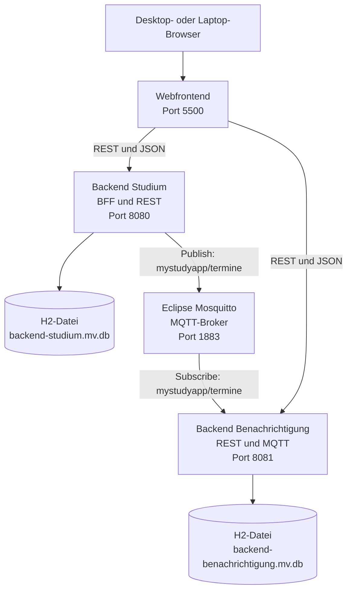
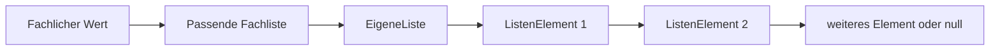

# MyStudyApp

MyStudyApp ist eine verteilte Webanwendung zur Organisation des Studiums. Die Anwendung
bündelt Stundenplan, Fächer, Gruppen, Termine, Erinnerungen und Benachrichtigungen in
einer gemeinsamen Oberfläche für Desktop- und Laptop-Browser.

Das Projekt besteht aus einem Webfrontend, zwei Spring-Boot-Backends, einem MQTT-Broker
und zwei persistenten H2-Datenbanken. Das Backend Studium übernimmt zusätzlich die Rolle
eines Backends für das Frontend und liefert über eine Fassade eine gemeinsame
Studienübersicht.

## Inhalt

- [Funktionen](#funktionen)
- [Systemarchitektur](#systemarchitektur)
- [Technologien](#technologien)
- [Entwurfsmuster](#entwurfsmuster)
- [Eigene Datenstruktur](#eigene-datenstruktur)
- [Projektstruktur](#projektstruktur)
- [Schnellstart mit Docker Compose](#schnellstart-mit-docker-compose)
- [Adressen und Ports](#adressen-und-ports)
- [REST-Schnittstellen](#rest-schnittstellen)
- [Datenhaltung](#datenhaltung)
- [Projekt übertragen](#projekt-auf-einen-anderen-rechner-übertragen)
- [Lokaler Maven-Build](#lokaler-maven-build)
- [Fehlerbehebung](#fehlerbehebung)

## Funktionen

### Dashboard

- Anzahl der Stundenplan-Einträge anzeigen
- Anzahl der gespeicherten Fächer anzeigen
- Anzahl der fälligen Erinnerungen anzeigen
- Tagesübersicht der nächsten Stundenplan-Einträge anzeigen
- nächsten gespeicherten Termin anzeigen
- direkt zu Stundenplan, Studienplanung und Benachrichtigungen wechseln

### Stundenplan

- Wochenansicht von Montag bis Freitag anzeigen
- zwischen vorheriger, aktueller und nächster Woche wechseln
- Stundenplan-Einträge nach Datum und Uhrzeit einordnen
- Termine zusätzlich in der Wochenansicht anzeigen

### Studienplanung

- Stundenplan-Einträge anlegen, bearbeiten und löschen
- Fächer mit Fachname und Lehrperson verwalten
- Gruppen mit Gruppenname und Personenanzahl verwalten
- vorhandene Fächer und Gruppen auswählen
- beim Planen direkt ein neues Fach oder eine neue Gruppe anlegen
- gespeicherte Fächer und Gruppen durchsuchen

### Termine

- Termine über die REST-Schnittstelle anlegen, lesen, bearbeiten und löschen
- Termine im Dashboard und in der Wochenansicht darstellen
- beim Anlegen eines neuen Termins automatisch ein MQTT-Ereignis veröffentlichen

### Erinnerungen und Benachrichtigungen

- gespeicherte Erinnerungen und Benachrichtigungen gemeinsam anzeigen
- Hinweise nach „Alle“, „Benachrichtigungen“ oder „Erinnerungen“ filtern
- Hinweise manuell neu laden
- aus einem neuen Termin automatisch eine Erinnerung erzeugen
- aus derselben Erinnerung automatisch eine sichtbare Benachrichtigung erzeugen

## Systemarchitektur



### Ablauf beim Anlegen eines Termins

1. Ein neuer Termin wird an `POST /api/termine` gesendet.
2. Das Backend Studium prüft und speichert den Termin.
3. `TerminEreignisFabrik` erzeugt ein `StudiumEreignis`.
4. `MqttEreignisSender` veröffentlicht die Nachricht auf `mystudyapp/termine`.
5. Eclipse Mosquitto leitet die Nachricht an das Backend Benachrichtigung weiter.
6. `MqttEreignisEmpfaenger` wandelt die MQTT-Nachricht in ein `TerminEreignis` um.
7. `MqttTerminEreignisQuelle` informiert den angemeldeten `ErinnerungDienst`.
8. Der `ErinnerungDienst` speichert eine Erinnerung.
9. Der `BenachrichtigungDienst` speichert zusätzlich eine sichtbare Benachrichtigung.
10. Das Frontend lädt beide Hinweise über REST.

## Technologien

| Bereich                           | Verwendete Technik                        |
| --------------------------------- | ----------------------------------------- |
| Programmiersprache                | Java 21                                   |
| Backend                           | Spring Boot 3.3.5                         |
| Webschnittstellen                 | Spring Web, REST und JSON                 |
| Datenzugriff                      | Spring JDBC mit `JdbcTemplate`            |
| Standard-Datenbank                | H2 im Dateimodus                          |
| Optionale Datenbank-Infrastruktur | MariaDB 11.4                              |
| Asynchrone Kommunikation          | MQTT mit Spring Integration               |
| MQTT-Broker                       | Eclipse Mosquitto 2.0                     |
| Frontend                          | HTML5, CSS3 und JavaScript ohne Framework |
| Frontend-Auslieferung             | Nginx 1.27 Alpine                         |
| Frontend-Grundlage                | Manifest, App-Symbole und Service Worker  |
| Build                             | Maven-Multi-Modul-Projekt                 |
| Container                         | Docker und Docker Compose                 |
| Automatischer Build               | GitHub Actions mit Temurin Java 21        |
| UML                               | PlantUML                                  |

Die Weboberfläche ist für Desktop und Laptop vorgesehen. `manifest.json` und
`service-worker.js` stellen zusätzlich die technische Grundlage für eine installierbare
Webanwendung und den Cache der statischen Frontend-Dateien bereit.

## Entwurfsmuster

| Muster        | Kategorie        | Umsetzung im Projekt                                                                                              |
| ------------- | ---------------- | ----------------------------------------------------------------------------------------------------------------- |
| Fassade       | Strukturmuster   | `StudiumFassade` bündelt Stundenplan-, Kurs-, Gruppen- und Termin-Dienst für `/api/studium/uebersicht`.           |
| Fabrikmethode | Erzeugungsmuster | `StudiumEreignisFabrik` und `TerminEreignisFabrik` erzeugen das Ereignis für einen neuen Termin.                  |
| Adapter       | Strukturmuster   | `MqttEreignisSender` und `MqttEreignisEmpfaenger` trennen die Fachlogik von der MQTT-Technik.                     |
| Beobachter    | Verhaltensmuster | `MqttTerminEreignisQuelle` informiert `TerminEreignisBeobachter`; `ErinnerungDienst` ist der konkrete Beobachter. |

Das Singleton-Muster wird nicht verwendet. Die Lebenszyklen der Spring-Komponenten
werden durch den Spring-Container verwaltet.

## Eigene Datenstruktur

Die Backends verwenden intern keine `ArrayList`. Stattdessen besitzt jedes Backend eine
selbst programmierte, einfach verkettete `EigeneListe` mit `ListenElement`.



Die zentrale Liste arbeitet ohne Generics und ohne Java-Listenklasse. Sie speichert
intern `Object`-Werte, während fachlich getrennte Listen nur den jeweils passenden Typ
nach außen anbieten:

- `StundenplanListe`
- `KursListe`
- `GruppeListe`
- `TerminListe`
- `BenachrichtigungListe`
- `TerminEreignisBeobachterListe`

Die grundlegenden Listenoperationen sind:

- Wert am Ende hinzufügen
- Wert an einer Position lesen
- Anzahl der Werte liefern
- Beobachter im Backend Benachrichtigung entfernen

An der REST-Ausgabegrenze werden die Inhalte in fachliche Felder wie `Kurs[]`,
`Termin[]` oder `Benachrichtigung[]` umgewandelt. Dadurch bleiben die internen
Listenklassen einfach und fachlich getrennt.

## Projektstruktur

```text
my-study-app/
├── .github/
│   └── workflows/
│       └── maven-build.yml
├── backend-studium/
│   ├── Dockerfile
│   ├── pom.xml
│   └── src/main/
│       ├── java/de/fhdo/swt2/backendstudium/
│       └── resources/
│           ├── application.properties
│           ├── application-mariadb.properties
│           ├── schema.sql
│           └── data.sql
├── backend-benachrichtigung/
│   ├── Dockerfile
│   ├── pom.xml
│   └── src/main/
│       ├── java/de/fhdo/swt2/backendbenachrichtigung/
│       └── resources/
│           ├── application.properties
│           ├── application-mariadb.properties
│           └── schema.sql
├── datenbank/
│   ├── backend-studium.mv.db
│   └── backend-benachrichtigung.mv.db
├── docker-backup/
├── docs/
│   └── uml/
├── infrastructure/
│   └── mosquitto/config/mosquitto.conf
├── web-frontend/
│   ├── design/
│   ├── icons/
│   ├── Dockerfile
│   ├── index.html
│   ├── style.css
│   ├── app.js
│   ├── manifest.json
│   └── service-worker.js
├── .dockerignore
├── .gitignore
├── DATENBANK-INFO.txt
├── docker-compose.yml
├── pom.xml
└── README.md
```

Die fachlichen Backend-Module folgen jeweils derselben klaren Richtung:

```text
REST-Controller → Dienst → Ablage → Datenbank
```

Die Projektarbeit wird ausschließlich über GitHub Issues und GitHub Milestones
organisiert.

## Schnellstart mit Docker Compose

### Voraussetzung

Benötigt wird nur eine laufende Docker-Umgebung mit Docker Compose, zum Beispiel Docker
Desktop. Java und Maven müssen für diesen Startweg nicht lokal installiert sein, weil
die Backend-Dockerfiles den Maven-Build und Java 21 bereits enthalten.

### Projekt starten

Im Hauptordner `my-study-app` ausführen:

```bash
docker compose up --build
```

Der erste Build kann länger dauern, weil Docker-Images und Maven-Abhängigkeiten geladen
werden.

Danach im Browser öffnen:

```text
http://localhost:5500
```

### Im Hintergrund starten

```bash
docker compose up --build -d
```

Status aller Container anzeigen:

```bash
docker compose ps
```

### Projekt beenden

```bash
docker compose down
```

Dieser Befehl entfernt die Container und das Docker-Netzwerk, aber nicht die H2-Dateien
im Ordner `datenbank/`.

### Protokolle anzeigen

```bash
docker compose logs -f
```

Nur die beiden Backends und den MQTT-Broker beobachten:

```bash
docker compose logs -f backend-studium backend-benachrichtigung mqtt-broker
```

## Adressen und Ports

| Komponente               | Adresse oder Port       | Aufgabe                                                                   |
| ------------------------ | ----------------------- | ------------------------------------------------------------------------- |
| Webfrontend              | `http://localhost:5500` | sichtbare MyStudyApp-Weboberfläche                                        |
| Backend Studium          | `http://localhost:8080` | Studienfunktionen und BFF-/Fassaden-API                                   |
| Backend Benachrichtigung | `http://localhost:8081` | Erinnerungs- und Benachrichtigungs-API                                    |
| MQTT-Broker              | `localhost:1883`        | asynchrone Termin-Ereignisse                                              |
| MariaDB-Container        | `localhost:3306`        | vorbereitete, im Standardbetrieb nicht verwendete Datenbank-Infrastruktur |

Wichtig: `http://localhost:8080/` und `http://localhost:8081/` besitzen keine
HTML-Startseite. Eine Spring-Whitelabel-Seite oder `404 Not Found` an diesen beiden
Stammadressen ist deshalb normal. Die sichtbare Anwendung läuft auf Port `5500`; die
Backends liefern Daten ausschließlich unter `/api/...`.

## REST-Schnittstellen

### Backend Studium – Port 8080

| Methode  | Pfad                      | Aufgabe                                                  |
| -------- | ------------------------- | -------------------------------------------------------- |
| `GET`    | `/api/studium/uebersicht` | Stundenplan, Fächer, Gruppen und Termine gemeinsam laden |
| `GET`    | `/api/stundenplan`        | alle Stundenplan-Einträge laden                          |
| `POST`   | `/api/stundenplan`        | Stundenplan-Eintrag anlegen                              |
| `PUT`    | `/api/stundenplan/{id}`   | Stundenplan-Eintrag bearbeiten                           |
| `DELETE` | `/api/stundenplan/{id}`   | Stundenplan-Eintrag löschen                              |
| `GET`    | `/api/kurse`              | alle Fächer laden                                        |
| `POST`   | `/api/kurse`              | Fach anlegen                                             |
| `PUT`    | `/api/kurse/{id}`         | Fach bearbeiten                                          |
| `DELETE` | `/api/kurse/{id}`         | Fach löschen                                             |
| `GET`    | `/api/gruppen`            | alle Gruppen laden                                       |
| `POST`   | `/api/gruppen`            | Gruppe anlegen                                           |
| `PUT`    | `/api/gruppen/{id}`       | Gruppe bearbeiten                                        |
| `DELETE` | `/api/gruppen/{id}`       | Gruppe löschen                                           |
| `GET`    | `/api/termine`            | alle Termine laden                                       |
| `POST`   | `/api/termine`            | Termin anlegen und MQTT-Ereignis auslösen                |
| `PUT`    | `/api/termine/{id}`       | Termin bearbeiten                                        |
| `DELETE` | `/api/termine/{id}`       | Termin löschen                                           |

Das Frontend verwendet zusätzlich die vorhandenen Routen `einfach-speichern`,
`einfach-bearbeiten` und `einfach-loeschen` mit URL-Parametern. Die REST-Controller
unterstützen außerdem die alternativen `POST`-Routen `bearbeiten/{id}` und
`loeschen/{id}`.

### Backend Benachrichtigung – Port 8081

| Methode | Pfad                      | Aufgabe                                       |
| ------- | ------------------------- | --------------------------------------------- |
| `GET`   | `/api/benachrichtigungen` | alle Benachrichtigungen laden                 |
| `POST`  | `/api/benachrichtigungen` | Benachrichtigung anlegen                      |
| `GET`   | `/api/erinnerungen`       | alle automatisch erzeugten Erinnerungen laden |

### Wichtige API-Tests

```bash
curl http://localhost:8080/api/studium/uebersicht
curl http://localhost:8080/api/stundenplan
curl http://localhost:8080/api/kurse
curl http://localhost:8080/api/gruppen
curl http://localhost:8080/api/termine
curl http://localhost:8081/api/benachrichtigungen
curl http://localhost:8081/api/erinnerungen
```

Wenn der Browser bei diesen Adressen JSON-Text anzeigt, arbeiten die REST-Schnittstellen
korrekt.

### Neuen Termin anlegen

```bash
curl -X POST http://localhost:8080/api/termine \
  -H "Content-Type: application/json" \
  -d '{"titel":"Prüfungstermin","datum":"2026-08-20","uhrzeit":"10:00"}'
```

Nach erfolgreicher Verarbeitung enthält das Backend Studium den Termin. Bei aktivem MQTT
entstehen im Backend Benachrichtigung zusätzlich eine Erinnerung und eine
Benachrichtigung.

### Neues Fach anlegen

```bash
curl -X POST http://localhost:8080/api/kurse \
  -H "Content-Type: application/json" \
  -d '{"name":"Softwaretechnik 2","dozent":"Prof. Beispiel"}'
```

### Neue Gruppe anlegen

```bash
curl -X POST http://localhost:8080/api/gruppen \
  -H "Content-Type: application/json" \
  -d '{"name":"Lerngruppe A","beschreibung":"Gemeinsames Lernen","personenAnzahl":4}'
```

## Datenhaltung

### Aktiver Standardbetrieb

Beide Backends verwenden standardmäßig eine eigene persistente H2-Datenbank im
Dateimodus:

```text
datenbank/backend-studium.mv.db
datenbank/backend-benachrichtigung.mv.db
```

Docker bindet den lokalen Ordner `datenbank/` als `/app/datenbank` in beide
Backend-Container ein. Dadurch bleiben die Daten nach `docker compose down`, einem
Neustart oder einem erneuten Build erhalten.

### Tabellen

| Backend                  | Tabelle            | Inhalt                                     |
| ------------------------ | ------------------ | ------------------------------------------ |
| Backend Studium          | `stundenplan`      | Einträge der Wochenplanung                 |
| Backend Studium          | `kurs`             | Fächer und Lehrpersonen                    |
| Backend Studium          | `gruppe`           | Gruppen und Personenanzahl                 |
| Backend Studium          | `termin`           | einzelne Termine                           |
| Backend Benachrichtigung | `erinnerung`       | automatisch erzeugte Erinnerungen          |
| Backend Benachrichtigung | `benachrichtigung` | sichtbare Benachrichtigungen und Empfänger |

Die beiden `schema.sql`-Dateien legen fehlende Tabellen beim Start automatisch an.
`backend-studium/src/main/resources/data.sql` ergänzt sechs Fächer und sechs Gruppen als
Startdaten, sofern die jeweiligen IDs noch nicht vorhanden sind. Bereits vorhandene
Einträge werden nicht überschrieben.

### MariaDB

`docker-compose.yml` startet zusätzlich einen MariaDB-Container mit einem eigenen
Docker-Volume. Die beiden Backends sind im aktuellen Standardbetrieb jedoch ausdrücklich
mit den H2-Dateien verbunden. Die Dateien `application-mariadb.properties` und der
MariaDB-Treiber bereiten einen späteren Wechsel vor; ohne eine bewusste Profil- und
Verbindungsumstellung wird MariaDB von den Backends nicht verwendet.

## Projekt auf einen anderen Rechner übertragen

1. Alle Container sauber beenden:

   ```bash
   docker compose down
   ```

2. Den vollständigen Ordner `my-study-app` kopieren oder als ZIP-Datei übertragen.
3. Darauf achten, dass der Ordner `datenbank/` mit beiden `.mv.db`-Dateien enthalten
   ist.
4. Auf dem anderen Rechner den Projektordner öffnen.
5. Im Hauptordner erneut starten:

   ```bash
   docker compose up --build
   ```

Für den normalen Projektbetrieb ist kein separater Datenbankexport nötig, weil die
aktiven H2-Daten direkt im Projektordner liegen. Der Ordner `docker-backup/` enthält
zusätzlich vorhandene Sicherungsarchive der Docker-Infrastruktur.

## Lokaler Maven-Build

Für die Entwicklung ohne Docker werden Java 21 und Maven benötigt.

Im Hauptordner ausführen:

```bash
mvn clean install
```

Der Maven-Reaktor baut beide Module:

1. `backend-studium`
2. `backend-benachrichtigung`

Der gleiche Befehl wird bei Pushes und Pull Requests auf `main` durch
`.github/workflows/maven-build.yml` ausgeführt.

Für den vollständigen Systembetrieb einschließlich Frontend, MQTT und korrekter
Container-Konfiguration wird der Docker-Compose-Start empfohlen.

## Fehlerbehebung

### Port 8080 oder 8081 zeigt eine Whitelabel-Seite

Das ist an der Stammadresse normal. Verwende:

```text
Weboberfläche:  http://localhost:5500
Studien-API:    http://localhost:8080/api/studium/uebersicht
Hinweise-API:   http://localhost:8081/api/benachrichtigungen
```

### Im Browser werden nur JSON-Daten angezeigt

Das ist bei einer `/api/...`-Adresse korrekt. JSON ist die Datenausgabe des Backends.
Die gestaltete Weboberfläche befindet sich unter `http://localhost:5500`.

### Das Frontend meldet, dass ein Backend nicht erreichbar ist

Containerstatus prüfen:

```bash
docker compose ps
```

Backend-Protokolle prüfen:

```bash
docker compose logs backend-studium backend-benachrichtigung
```

Anschließend die Seite über die Schaltfläche „Neu laden“ oder mit einer vollständigen
Browser-Aktualisierung erneut laden.

### Die API wird beim direkten Öffnen der HTML-Datei blockiert

`index.html` nicht über `file://` öffnen. Die CORS-Konfiguration erlaubt das Frontend
unter diesen beiden Ursprüngen:

```text
http://localhost:5500
http://127.0.0.1:5500
```

### Ein Port ist bereits belegt

MyStudyApp benötigt die Ports `5500`, `8080`, `8081`, `1883` und `3306`.

Unter macOS oder Linux prüfen:

```bash
lsof -nP -iTCP:5500 -sTCP:LISTEN
lsof -nP -iTCP:8080 -sTCP:LISTEN
lsof -nP -iTCP:8081 -sTCP:LISTEN
lsof -nP -iTCP:1883 -sTCP:LISTEN
lsof -nP -iTCP:3306 -sTCP:LISTEN
```

Unter Windows PowerShell prüfen:

```powershell
netstat -ano | findstr :5500
netstat -ano | findstr :8080
netstat -ano | findstr :8081
netstat -ano | findstr :1883
netstat -ano | findstr :3306
```

Danach den belegenden Prozess oder die andere Docker-Umgebung beenden und MyStudyApp neu
starten:

```bash
docker compose down --remove-orphans
docker compose up --build
```

### Alte Frontend-Dateien werden angezeigt

Der Service Worker speichert statische Frontend-Dateien im Browsercache. Eine
vollständige Aktualisierung ausführen oder die Website-Daten für `localhost:5500` im
Browser löschen.

### Die H2-Datenbank ist gesperrt

Nicht gleichzeitig dieselben H2-Dateien mit Docker und einer zweiten lokal gestarteten
Backend-Instanz öffnen. Eine der beiden Umgebungen vollständig beenden und danach nur
eine Umgebung starten.

### Docker verwendet noch einen alten Backend-Build

```bash
docker compose down
docker compose build --no-cache
docker compose up
```
